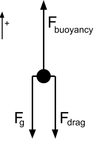
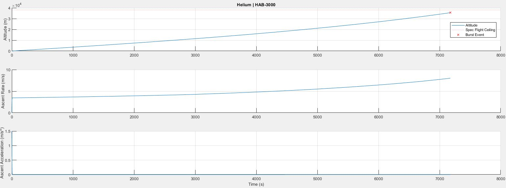

# 1D Atmospheric Flight Model

A simple, one-dimensional flight model is used to predict the HAB’s flight
profile in the vertical axis, including altitude, ascent rate, and ascent
accelerations.

## 1976 COESA Atmosphere Model

The atmosphere model is an implementation of the 1976 COESA Atmosphere Model,
used in Simulink as the [COESA block from MATLAB’s Aerospace Toolbox](https://www.mathworks.com/help/aeroblks/coesaatmospheremodel.html)
or the Python package [Ambiance](https://github.com/airinnova/ambiance/). Both
methods approximate atmospheric temperature, pressure, and density using a
piecewise curve fit for the layers of the atmosphere based on this standard
model.

<!-- NOT READY FOR PRIME TIME --
### Implementation

#### Simulink with MATLAB Aerospace Toolbox


#### Python with Ambiance

!!! To-do
    {code snippet from python}

    {plots of temperature, pressure, volume, density with altitude}
-->
### Limitations

There are significant limitations to this atmosphere model, but it does well
enough for us to get by.

- The model is not a function of humidity.
- The model does not account for differences due to the geographic location of
  the launch site such as latitude or local geography.
- The model does not account for local weather conditions, convection currents,
  disturbances, or wind currents.
- The layers of the atmosphere are modeled as discrete zones with
  discontinuities at fixed boundaries but the real layers of the atmosphere are
  continuous.

Our approach to modeling the balloon’s flight is an approximation anyway, and
most of these limitations require more precision than a vertical-axis flight
prediction would reasonably provide. We can still use this atmosphere model to
understand the overarching forces that dominate the flight’s ascent rate and
altitude over time, accepting variations as noise.

For more advanced applications that directly depend on atmospheric conditions
such as altitude control, we need to design a system that can compensate for
variations. By injecting random noise or random variations into the model’s
outputs, we can approximate the system’s performance in response to changing
weather or disturbances like convection.

## Balloon Flight Model

### Assumptions & Simplifications
For this flight model, we are primarily interested in how the HAB changes
altitude with time. Eventually, we might consider modeling the 3D flight path
over time but for now, we’ll table that for the future. By only considering the
vertical axis we don’t have to worry about the geographic location of the
launch site as much, we can ignore lateral wind currents, and we reduce the
coordinate frame from 3 axes to one axis. In short, the math gets a lot easier
and there are much fewer variables to worry about.

| Assumption | Justification |
|---|---|
| We draw the control volume around the whole system (balloon, parachute, and payload) so that we are left with a point mass that reacts to atmospheric conditions. | We ignore interactions between the balloon and the payload through the tether and treat it as a blob that has lighter-than-air gas in it and a bunch of dead weight. Rotating doesn’t change the behavior of the blob, and the blob is too small to have differential effects from its size. |
| We constrain the model to only the vertical axis, ignoring any lateral or rotational forces.  | This greatly simplifies our problem, distilling the system into a set of directly opposing forces in the vertical axis. |
| We assume that the lift gas in the balloon is always at the same temperature and pressure as ambient air. | Our model is not precise enough to account for thermodynamic effects caused by the balloon material, and at steady state the gas in the balloon will equalize to be close enough to ambient temperature and pressure that it’s not worth taking into account. |
| Drag only acts on the projected surface area from above looking down. Assume the balloon inflates as a sphere. | We don't need to account for complicated aerodynamics. The size of the balloon is much larger than the size of the payload, so we can ignore the effects of drag on anything other than the balloon. When the balloon inflates it is not quite a sphere, but the true geometry is not close enough to account for differences. |
| The lift gas behaves as an ideal gas. | It's not worth the time or complexity to implement gas properties more in-depth than the Ideal Gas Law. |

### Forces at Play

#### Buoyancy
The buoyancy force comes from the difference in densities between the gas in
the balloon and the volume of atmosphere it displaces. The balloon’s volume
This force accounts for the weight of the lift gas.

```python
buoyancy_force = balloon_volume * (lift_gas_density - air_density) * gravity
```

Remember that gravity is a negative (downward) acceleration. We arrange the
subtraction between densities so that the buoyancy force is positive (upward).

#### Weight
Aside from the lift gas, the only force acting on the rest of the mass in our
control volume is from gravity. Since the HAB flies at altitudes in excess of
30 km, we must account for changes in gravity with respect to altitude.

```python
standard_gravity = 9.80665 # [m/s^2]
earth_mean_radius = 6.3781e6 # [m]
gravity = standard_gravity * (earth_mean_radius / (earth_mean_radius + altitude))**2

weight = gravity * (balloon_mass + payload_mass)
```

#### Drag
Even though the buoyancy force is constantly greater than weight for the
balloon to rise, the balloon does not accelerate constantly because there is
drag from the air acting against the surface of the balloon. Drag always
opposes the direction of motion.

The volume (and therefore windward area) of the balloon changes with altitude.
We assume the shape stays the same though, so the coefficient of drag does not
change.

```python
balloon_radius = (balloon_volume * 3 / (4 * PI)) ** (1/3)
windward_area = PI * (balloon_radius) ** 2
drag_force = 1/2 * (ascent_rate ** 2) * atmospheric_density * drag_coefficient * windward_area
```

#### Sum of Forces / Net Force



The net force on the balloon-payload system is the sum of three primary forces:
buoyancy, weight, and drag.

| Force | as a function of | Rationale |
|---|---|---|
| Buoyancy | mass of lift gas in the balloon, altitude | Buoyancy is a function of the amount of lift gas in the balloon and the temperature, pressure, and density of the atmosphere. Using the COESA Atmosphere Model, temperature, pressure, and density of air are all functions of altitude only, so we can reduce the buoyancy force to be only a function of altitude. |
| Drag | mass of lift gas in the balloon, altitude, ascent rate | Drag is a function of the windward area and velocity. Following the ideal gas law, the windward area can be derived from the volume of the balloon, and therefore from the amount of lift gas in the balloon and atmospheric conditions at a given temperature. |
| Weight | mass of everything other than lift gas, altitude | The buoyancy force accounts for the mass of the lift gas, but the effect of gravity on every other part of the system still needs to be taken into account. The acceleration due to gravity changes as slightly as a function of altitude. Weight can be further divided up into which component is measured, like balloon mass, payload bus mass, payload electronics mass, et cetera. |

#### Free Lift

Free Lift is an alternative way to measure the lift from the balloon and is a
handy way to make sure the balloon is filled to the right level or to calculate
the ascent rate and other things with the [HABHub Burst Calculator](http://habhub.org/calc/).
Free lift measures the net amount of lift provided by the helium in units of
kilograms. I like to think of free lift as being what a fish scale would read
if you attached it to the payload and filled up the balloon. Effectively this
is a measure of net force without the acceleration term.

### Balloon Parameters

Parameters like the coefficient of drag and balloon mass are obtained from the
balloon spec sheet from the manufacturer. If the volume of the lift gas exceeds
the max volume listed in the spec sheet or the internal pressure exceeds the
max listed pressure, we assume the balloon will burst. Likewise, the
manufacturer provides a recommended Free Lift value for a given payload mass,
which is used to calculate things like estimated max altitude.

We use [Kaymont high altitude balloons](https://www.kaymont.com/habphotography)
as a reference for balloon parameters.

<!-- NOT READY FOR PRIME TIME --
## HAB Flight Simulation

To demonstrate we use a set of standard conditions to compare how each
implementation looks in terms of a HAB’s ascent profile.

| Parameter | Value |
|---|---|
| Payload Mass | 2.5 kg |
| Lift Gas Type | Helium |
| Lift Gas Mass | 2.41 kg |
| Balloon Type | [Kaymont HAB-3000](https://www.kaymont.com/product-page/hab-3000) |
| Balloon Mass | 3.00 kg |
| Drag Coefficient | 0.25 |

### MATLAB



### Python

!!! To-do
    {screenshot of plots from python}
-->
